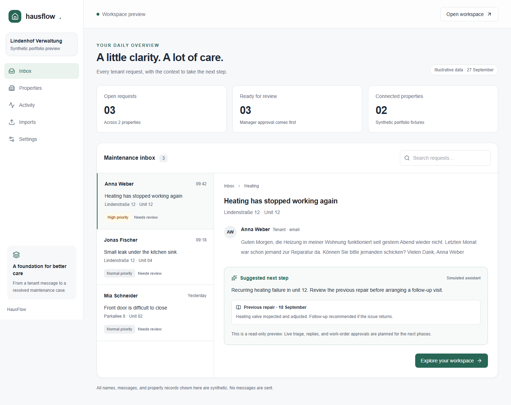

# HausFlow

A web application that turns tenant emails into trackable maintenance cases with AI suggestions, manager approval, and reliable background workflows.



[Watch the animated demo](docs/demo/hausflow-demo.gif) · [Browse all screenshots](docs/demo/README.md)

## Project background

I built HausFlow as an independent portfolio project inspired by a Powerprozesse full-stack developer role. The role combines everyday property-management software with data migration, communication integrations, and AI agents. HausFlow brings those concerns into one focused journey: a tenant reports a maintenance issue, the manager sees the property and repair history, reviews a suggested response, and tracks the work through resolution.

The project is designed to demonstrate product thinking alongside TypeScript full-stack engineering: a responsive Next.js interface, organization-scoped Convex data and workflows, explicit approval before outbound actions, and CSV migration with validation and safe re-imports. The public preview uses synthetic records; live email and AI integrations are still planned. HausFlow is not affiliated with Powerprozesse or hausverwalter.ai.

## Project status

Scaffold implemented on 2026-09-27. Next.js App Router, Tailwind, reusable shadcn-style Radix primitives, Clerk/Convex providers, and feature-based backend layers are in place. Dependencies are pinned in `package.json` and `pnpm-lock.yaml`.

The public preview supports request selection, search, and responsive navigation with clearly labeled synthetic data. Once configured, the authenticated workspace can create a personal demo organization, load sample properties and tenant records, process three simulated tenant scenarios, approve replies and work orders separately, inspect a simulated outbox and timeline, retry failures, and reset the demo. The connected `/imports` screen uploads and previews CSV files, then imports valid buildings, units, and tenants in background batches. Live email/AI integrations remain planned. No external services have been provisioned or deployed by this change.

## Run the preview

Use Node **24.21.0 LTS** (see `.nvmrc`) and pnpm **12.6.0**. The scaffold also supports the existing Node 22.22.3 environment used during initial checks.

```sh
cd hausflow
npm exec --yes --package=pnpm@12.6.0 -- pnpm install --frozen-lockfile
npm exec --yes --package=pnpm@12.6.0 -- pnpm dev
```

If pnpm 12.6.0 is already installed, use `pnpm install --frozen-lockfile` and `pnpm dev` directly. Open [localhost:3000](http://localhost:3000). The public preview needs no credentials and stores no tenant data. The connected seeded demo needs development Clerk and Convex accounts.

## Connect Clerk and Convex

1. Copy `.env.example` to `.env.local`. Set your Clerk publishable and secret keys. Do not commit this file.
2. Create a development project in the Convex dashboard. In Clerk, enable the Convex integration/JWT template named `convex` with audience `convex`.
3. In your Convex deployment environment, set `CLERK_JWT_ISSUER_DOMAIN` to the Clerk issuer URL. This is required by `convex/auth.config.ts` before deploying.
4. Run `pnpm backend`, sign in to Convex, and select the development project. Let the CLI populate the deployment and URL in `.env.local` and deploy the schema/functions. Keep this command running during backend development.
5. Run `pnpm dev` in another terminal. Restart Next.js after changing public environment variables.
6. Open `/workspace`, sign in, create your personal organization, then select **Load sample data**. Run a heating scenario, review the prior repair and instructions, approve an edited reply or work order, and inspect the simulated outbox. Refresh to verify persistence.
7. Open `/imports` to download a CSV template. Import buildings before units and tenants. Review invalid rows, confirm the valid rows, and use the error CSV for corrections. Re-importing the same external IDs updates or leaves existing records unchanged.

The connected scaffold starts empty. Building creation and sample-data reset are owner-only; maintenance operations require membership. Duplicate sample events return the original case, and a reset invalidates queued work from the previous demo generation. The public preview remains synthetic even after services are configured. No email or AI keys are required yet. A deployment-backed authentication smoke test requires your accounts and is not replaced by the local authorization tests.

## Development checks

```sh
pnpm format:check
pnpm lint
pnpm typecheck
pnpm test
pnpm build
pnpm exec playwright install chromium
pnpm test:e2e
```

Fifteen Convex tests exercise identity, organization isolation, manager permissions, sample-data seeding, duplicate requests, source grounding, draft versioning, approvals, simulated retries, reset safety, and CSV import validation/idempotency against the local test harness. Four browser scenarios run across desktop and mobile profiles using the credential-free preview. Browser tests start their own local server; stop an existing port-3000 server if it is configured differently.

`pnpm codegen` refreshes committed Convex-generated files after a deployment is configured. Initial generated files were produced locally from the installed Convex CLI templates without deploying. CI is provided for using `hausflow/` as the repository root; if you keep it as a subdirectory of a larger repository, move and adapt the workflow paths.

## Delivery sequence

1. **Core and demo:** scaffold the application, establish authentication and organization isolation, then build the complete maintenance journey with synthetic records and deterministic AI/email adapters.
2. **Live integrations:** connect Resend and Anthropic, add durable processing, approval-controlled sending, retry handling, and usage monitoring.
3. **Migration:** import buildings, units, and tenants from CSV with previews, row errors, progress tracking, and safe re-imports.

Each phase must meet its acceptance criteria before proceeding. All three phases belong to the agreed scope.

## Portfolio walkthrough

Sign in and open a personal demo workspace. Load sample data and simulate a German tenant email about a recurring heating failure. Inspect the previous repair and the assistant's cited instructions, review a proposed reply and work order, approve them, and resolve the case. Replay the event to show duplicate prevention and demonstrate a recoverable failure. Then import a small CSV portfolio, show row errors and progress, and re-import an identical file to demonstrate idempotency.

Record an English walkthrough and report measured results, limitations, and engineering decisions. Demo AI responses must be visibly labeled as simulated. No production-use or performance claims should be made before they are verified.

## Next implementation checkpoint

Configure development Clerk/Convex accounts and verify the real authenticated round trip, including a CSV upload. Implement remaining property controls, then connect signed email webhooks and a bounded live agent. See the acceptance criteria in the FRD before connecting live integrations.

## License

HausFlow is released under the [MIT License](LICENSE).
